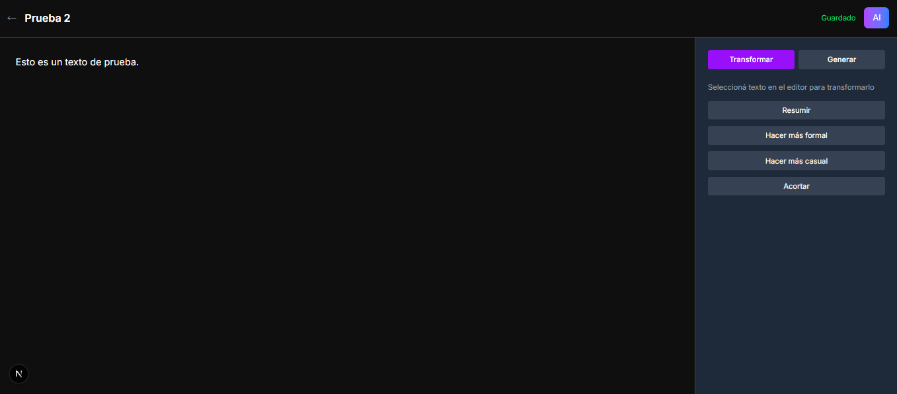
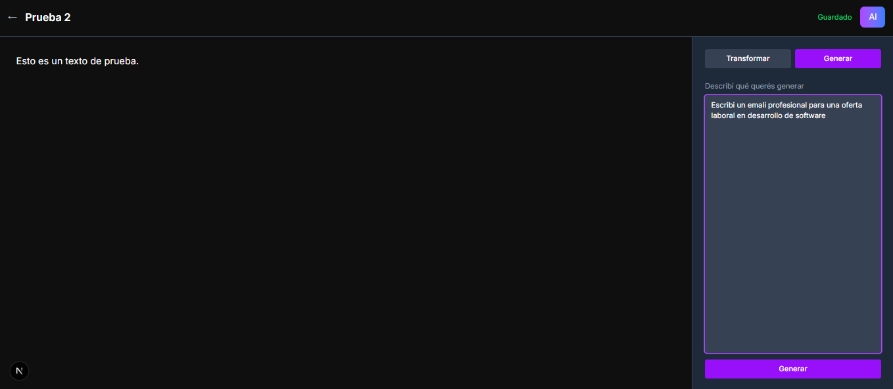
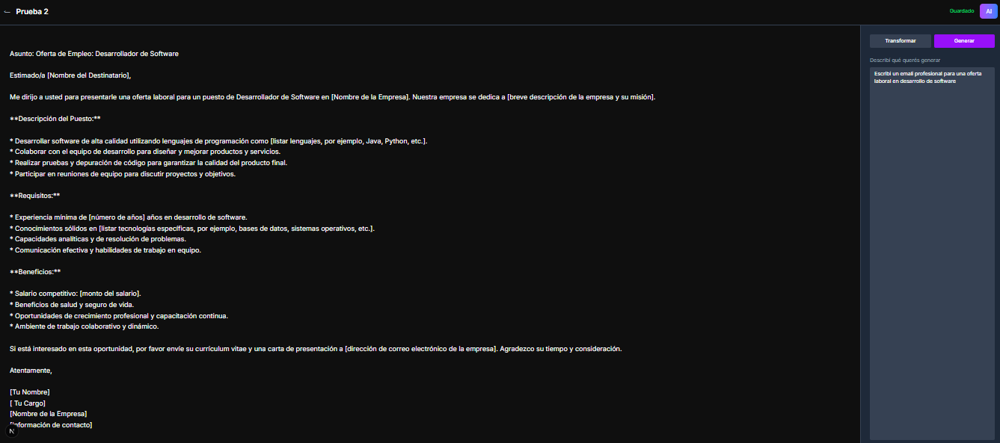

# Quill — Bloc de notas con IA

## 🚀 Demo

[Live Demo](https://quill-zeta-two.vercel.app)

## 📸 Screenshots





## 📌 Descripción

Quill es un bloc de notas moderno impulsado por IA que te permite crear, editar y organizar tus documentos de manera eficiente. Soluciona el problema de la gestión de notas tradicionales al integrar inteligencia artificial para resumir, reescribir y generar contenido automáticamente. Con autenticación segura y un diseño oscuro elegante, Quill hace que escribir y colaborar sea una experiencia fluida y productiva.

## ✨ Features

- Autenticación con Google y Magic Link (Supabase)
- Editor de documentos con guardado automático
- IA integrada para resumir, reescribir y generar contenido (Groq - Llama 3.3)
- Diseño oscuro moderno con tipografía Inter

## 🛠️ Tech Stack

- Next.js 14 (App Router)
- TypeScript
- Tailwind CSS
- Supabase (Auth + PostgreSQL)
- Groq API (Llama 3.3 70b)
- shadcn/ui

## ⚙️ Correr localmente

1. Cloná el repositorio:

   ```bash
   git clone https://github.com/tu-usuario/quill.git
   cd quill
   ```

2. Instalá las dependencias:

   ```bash
   npm install
   # o
   yarn install
   # o
   pnpm install
   ```

3. Creá un archivo `.env.local` en la raíz del proyecto y agregá las variables de entorno necesarias (ver sección Variables de entorno).

4. Corré el servidor de desarrollo:

   ```bash
   npm run dev
   # o
   yarn dev
   # o
   pnpm dev
   ```

5. Abrí [http://localhost:3000](http://localhost:3000) en tu navegador para ver la aplicación.

## 🗄️ Variables de entorno

Creá un archivo `.env.local` en la raíz del proyecto con las siguientes variables:

| Variable                        | Descripción                                  |
| ------------------------------- | -------------------------------------------- |
| `NEXT_PUBLIC_SUPABASE_URL`      | URL de tu proyecto Supabase                  |
| `NEXT_PUBLIC_SUPABASE_ANON_KEY` | Clave anónima de Supabase para autenticación |
| `GROQ_API_KEY`                  | Clave API de Groq para funcionalidades de IA |

## 📐 Arquitectura

Quill utiliza una arquitectura moderna basada en Next.js 14 con App Router para una navegación eficiente y renderizado del lado del servidor. La autenticación se maneja con Supabase, que proporciona una solución robusta y escalable para auth y base de datos PostgreSQL. Elegimos Groq en lugar de OpenAI por su tier gratuito generoso y mayor velocidad en respuestas. La estrategia combina componentes del servidor para optimizar el rendimiento y componentes del cliente solo donde se necesita interactividad, como en el editor de documentos.

## 🔮 Próximas features

- Compartir documentos con otros usuarios
- Exportar documentos a PDF
- Historial de versiones con rollback
